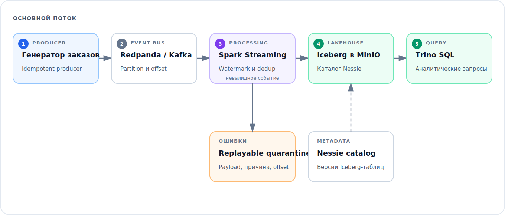

# Streaming Lakehouse для розничных заказов

Компактный пример событийного пайплайна с возможностью повторной обработки и расследования ошибок. События заказов поступают в Kafka, Spark Structured Streaming валидирует и дедуплицирует их, после чего принятые строки записываются в Iceberg-таблицу в S3-совместимом хранилище.

Основной акцент — на ситуациях, которые приводят к инцидентам в реальных потоках: повторная доставка, опоздавшие события, некорректный payload, восстановление по checkpoint и трассировка до Kafka offset.

## Схема потока



Модель события содержит отдельные идентификаторы и `event_time`. Streaming job сохраняет topic, partition и offset, применяет watermark в десять минут и удаляет дубликаты по `event_id`. Некорректный JSON и записи, не прошедшие бизнес-валидацию, попадают в replayable quarantine вместе с причиной.

## Локальный запуск

Поднять инфраструктурный слой:

```bash
docker compose up -d
python -m venv .venv
source .venv/bin/activate
pip install -e ".[dev,spark]"
python -m retail_streaming.producer --events 1000
```

Spark нужно запускать с версиями Kafka, Iceberg, Nessie и S3-коннекторов, совместимыми с выбранным дистрибутивом. Entry point:

```bash
python -m retail_streaming.stream_job
```

Версии JVM-коннекторов намеренно не спрятаны внутри Python-пакета: в рабочей среде их фиксируют в образе Spark или параметрах `spark-submit --packages`.

Интерфейсы: Redpanda Console — <http://localhost:18080>, MinIO — <http://localhost:19001>, Nessie API — <http://localhost:19120>, Trino — <http://localhost:18082>.

## Принятые решения

- Idempotent producer и стабильный ключ заказа сохраняют порядок событий одного заказа.
- Event time содержит timezone и не смешивается со временем поступления в Kafka.
- Watermark ограничивает state, оставляя допустимое окно для опоздавших событий.
- Дедупликация по `event_id` учитывает at-least-once delivery и не удаляет настоящие обновления заказа.
- Kafka offsets сохраняются в Iceberg для расследований и адресного replay.
- Пароль в Compose относится только к локальному стенду.

## Проверки

```bash
pip install -e ".[dev]"
ruff check .
pytest -q
docker compose config --quiet
```

Быстрые тесты проверяют producer-side контракт без запуска Kafka и скачивания Spark-образов; Docker Compose проходит статическую валидацию. Полный путь Spark → Iceberg требует integration run с совместимым набором коннекторов и не выдаётся за часть fast test suite.

## Границы проекта

Это локальный инженерный стенд, а не описание production-кластера. Для production потребуются постоянная БД Nessie, secrets management, Kafka ACL, метрики, обслуживание Iceberg-таблиц, retention policy и протестированный Spark image.

Архитектура опирается на публичную документацию Iceberg, Spark, Trino, Nessie и Redpanda, а также на открытые примеры вроде `danthelion/trino-minio-iceberg-example`. Код из этих проектов не копировался.
